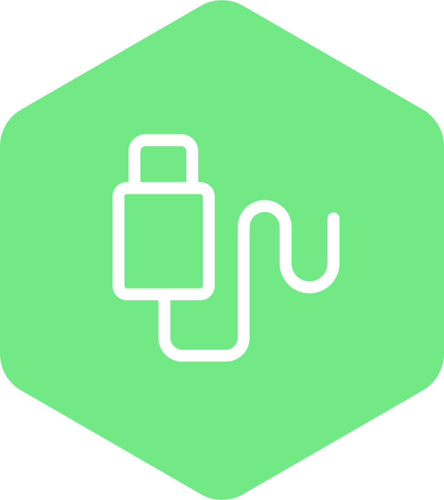

# 👋 I'm James (jeymz) but you can call me Jay
My career path in IT has been an interesting and fun journey. I have always been interested in technology since I was a kid and was blessed with having an opportunity to work in the field almost my entire career

## Languages & Frameworks

## Technologies

## I wear a lot of hats
- IT Helpdesk
- Desktop Support
- Server Administrator
- Network Operations
- Developer
- AppSec Analyst
- Consultant
- Architect

## I have a lot of interests
- DevSecOps
- Kubernetes
- Homelabs
- AppSec
- OWASP
- IAM (OAuth / OIDC)
- Open Source

## Links

## Metrics
]

### Special thanks to
*[Icons8](https://icons8.com) & [Devicon](https://devicon.dev) for the awesome icons* 
*[Creavite](https://auto.creavite.co/) for the excellent banner* 
*[Anuraghazra](https://github.com/anuraghazra/github-readme-stats) for the awesome GitHub stats / metrics*
